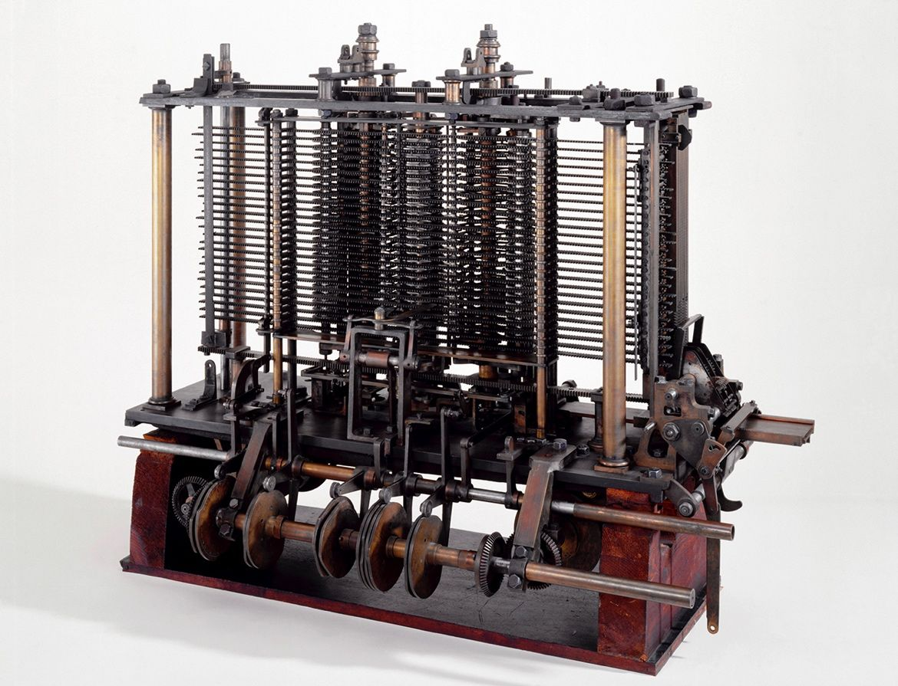

## Introduction
153 years ago today, Charles Babbage—one of history’s true polymath geniuses—died. Yet, his influence on the modern world is everywhere. Babbage’s most groundbreaking idea was the Analytical Engine, a mechanical marvel that essentially defined the blueprint for the computers we use today.

## The Analytical Engine: A Machine Ahead of Its Time
Babbage designed the Analytical Engine in the 1830s, envisioning a machine that could perform any calculation, guided by instructions on punched cards. The design included all the essential elements of a modern computer:

- The Mill: The processing unit, analogous to today’s CPU, handled arithmetic operations. 
- The Store: A memory unit that could hold 1,000 50-digit numbers. This was an unprecedented storage for its era. 
- Punched Cards: Borrowed from the Jacquard loom, these allowed the machine to be programmed, making it the first programmable computer concept. 
- Control and Output: The machine could make decisions (branching), repeat instructions (loops), and output results via a printer or punched cards.

## Legacy and Impact
Although the Analytical Engine was never completed during Babbage’s lifetime (due to technological and financial limitations) its design was Turing-complete in theory, meaning it could perform any calculation given enough memory. Ada Lovelace, Babbage’s collaborator, even wrote the first computer program for the Engine, earning her the title of the world’s first computer programmer.

Babbage’s vision was so far ahead that it would take over a century for technology to catch up. Today, every digital device - from smartphones to supercomputers - owes a debt to his pioneering ideas.

Conclusion
Charles Babbage’s Analytical Engine was more than an invention; it was the foundation of computer science. His work reminds us that the digital world we inhabit stands on the shoulders of visionaries who imagined the future long before it arrived.

“Errors using inadequate data are much less than those using no data at all.”
— Charles Babbage

