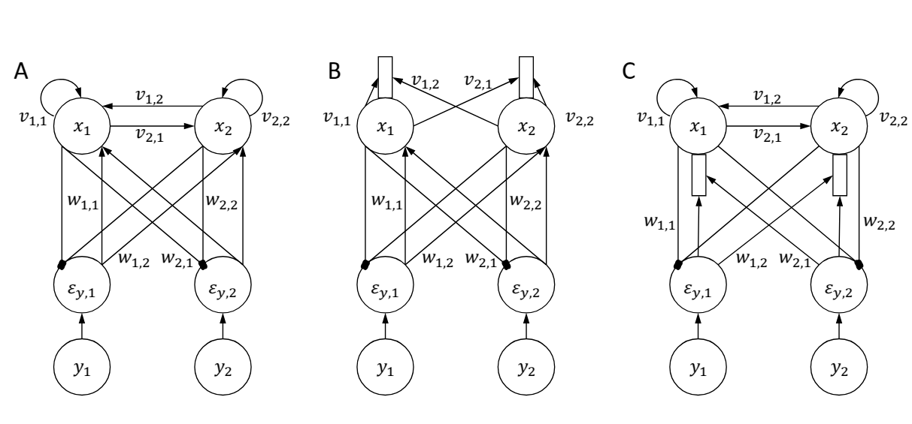
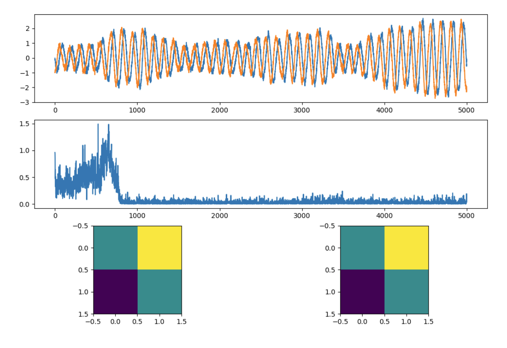

## Introduction
Predictive coding is an established model of perceptual inference and learning in hierarchical networks of the brain.
It describes a network of neuron-like nodes, which can infer stimulus properties from noisy input using only
_local computation_, i.e. the changes of activity of each neuron in the model is determined only by its inputs and its
current activity levels. Furthermore, the network encodes the estimated parameters of a probabilistic model from which
the stimuli are generated in its synaptic connections, and learn these parameters employing only 
_local plasticity_, where the changes in synaptic weights only depend of activities of pre and post-synaptic neurons. 
In its original form the predictive coding model assumes static input stimuli. However, most of 
the stimuli experienced by animals and humans change in time, and it is critical for survival to efficiently interpret
such stimuli.

Very soon after developing the predictive coding model, it was pointed that it could be generalized to dynamic stimuli,
and the Kalman filter could be employed to infer the states of hidden variables represented by the model. However that work has not described how such computation could be implemented in a biologically 
plausible network of neuron-like nodes. More recently, a generalization of predictive coding to dynamic stimuli has been 
proposed, in which different neurons represent not only the hidden variables, but also their temporal derivatives.
Although it is possible to implement this model in a network only employing local computation and local plasticity,
this network requires a very intricate and specific pattern of connectivity between various neurons, and there is no evidence that such connectivity exists in cortical circuits.

This report outlines a simple generalization of predictive coding model to dynamic stimuli, which does not require more
intricate network than the original predictive coding model. A simulation of the proposed generalizations is shown for
a toy problem, and directions are suggested in which the work on the model needs to be conducted.

## Model
### Process generating stimuli
In this report we assume that stimuli are generated from a very simple linear model, which parallels the assumptions
about signal made by the Kalman filter. Let us denote an observed stimulus at time
$t$ by a vector with elements $y_i(t)$. Let us assume that the stimulus depends on values of hidden variables
denoted by $x_j(t)$ according to:

$$
y_i(t) = \sum_j w_{i,j} x_j(t) + \epsilon_{y,i}(t)
\label{eq:gen_y}
$$

In the above equation, $w_{i,j}$ form a matrix of parameters, and $\epsilon_{y,i}(t)$ is a noise process (with zero mean).
Furthermore, let us assume that the hidden variables evolve according to:

$$
\dot{x}_j = \sum_k v_{j,k} x_k(t) + \epsilon_{x,j}(t)
\label{eq:gen_x}
$$

Analogously as above, $v_{j,k}$ form a matrix of parameters, and $\epsilon_{x,j}(t)$ is a noise process. 
A natural way for estimating $x_j$ from $y_i$ is to employ the Kalman filter, but it involves complex equations,
and it is not clear how such computation could be implemented in a network of neurons. Therefore, this report describes 
a simpler method for estimating $x_j$ that has a more natural neural implementation.

### Computations in the model

Given a observed stimuli $y_i$, we will seek to infer the hidden variables $x_j$ and estimate the parameters $w_{i,j}$ 
and $v_{j,k}$. In the reminder of Section 2, we will use $x_j$, $w_{i,j}$ and $v_{j,k}$ to denote the estimates of
corresponding terms in Equations \ref{eq:gen_y}. We wish to find $x_j$ such that the stimulus $y_i$ is 
close to the predicted value $\sum_j w_{i,j} x_j$. Thus we define error in prediction 
of $y_i$ as:

$$
e_i = y_i - \sum_j w_{i,j} x_j
\label{eq:error_y}
$$

We wish to minimize a squared sum of these errors which we denote by $E_y = \frac{1}{2} \sum_i \varepsilon_{y,i}^2$. 
Hence we change $x_j$ in the direction opposite to the gradient of $E_y$, but we additionally append this dynamics 
towards our goal with the natural evolution of $x_j$:

$$
\dot{x}_j = - \frac{\partial E_y}{\partial x_j} + \sum_k v_{j,k} x_k
$$

Evaluating the gradient, we obtain the equation describing the dynamics of our estimate of hidden variables:

$$
\dot{x}_j = \sum_i w_{i,j} \varepsilon_{y,i} + \sum_k v_{j,k} x_k
$$

In order to learn parameters $w_{i,j}$, which describe how $y_i$ depends on $x_j$, we modify them to minimize  $E_y$:

$$
\dot{w}_{i,j} = - \alpha \frac{\partial E_y}{\partial w_{i,j}} = \alpha \varepsilon_{y,i} x_j
$$

In the above equation $\alpha$ denotes a learning rate. In order to learn parameters $v_{j,k}$ describing the natural 
dynamics of hidden variables, we need to define an error in prediction of this dynamics:

$$
\varepsilon_{x,j} = \dot{x}_j - \sum_k v_{j,k} x_k
$$

We wish to minimize squared sum of these errors $E_x = \frac{1}{2} \sum_j \varepsilon_{x,j}^2$,
and hence we modify the weights in the direction opposite to the gradient of $E_x$ over $v_{j,k}$:

$$
\dot{v}_{j,k} = \alpha \varepsilon_{x,j} x_k
$$

In summary, this generalized predictive coding model continuously updates hidden variables and parameters according and
recomputes prediction errors.

### Possible neural implementations
Inference of hidden variables $x_j$ from sensory input $y_i$ can be easily performed in a network shown in Figure 1A.
The bottom layer consists of sensory neurons representing the stimulus. They project to neurons computing prediction
error. These errors are then send to the neurons encoding hidden variables which
change their activity according to Equation \ref{eq:dot_x}. The weights of connections between neurons encoding errors
and hidden variables are symmetric, i.e. equal in both direction. This network has an architecture very similar to 
a standard predictive coding model , but additionally includes recurrent connections between the
neurons encoding hidden variables with weights $v_{j,k}$.

Learning parameters $w_{i,j}$ corresponds to local Hebbian plasticity in the network
of Figure 1, analogously as in the standard predictive coding networks. However,
learning parameters $v_{j,k}$ is less straightforward because the
prediction error $\varepsilon_{x,j}$ is not explicitly represented in activity of any neurons in the network. 
Nevertheless, it is possible to construct models in which $\varepsilon_{x,j}$ would be represented in internal 
signals (e.g. concentrations of particular ions or proteins) within neurons encoding $x_j$,
and let us consider two such possible models.

The first model is illustrated in Figure 1B.
In this network, the recurrent inputs from neurons representing hidden variables converge on a separate dendritic 
branch, which sums them and thus can compute $\sum_k v_{j,k} x_k$. To compute the error $\varepsilon_{x,j}$, 
the neuron would need to compute the difference between change in its activity and the membrane potential in the dendrite.
Since both of these quantities are encoded within the same neuron, it is plausible that such a computation may be performed,
and an error encoded in an internal signal. Such signal could then drive local synaptic plasticity.

An alternative way of computing prediction errors  $\varepsilon_{x,j}$ relies on an observation that by combining 
equations describing the dynamics of $\dot{x}_j$ adn error $\varepsilon_{x,j}$, we see that these errors are equal to:

$$
\varepsilon_{x,j} = \sum_i w_{i,j} \varepsilon_{y,i}
$$

Such input from the previous layer of prediction error neurons could be computed in dendrites shown in
Figure 1C. The membrane potential of such dendrite would need to set level of an internal signal that would govern the 
plasticity within the entire neuron. This mechanism could be considered biologically plausible as it is analogous to
observations that high membrane potential of apical dendrites of pyramidal neurons triggers plateau potentials via
calcium influx, leading to a burst of spikes by the neuron. Such bursts of spikes may subsequently 
induce synaptic plasticity.

## Results
I tested the model on a simple problem in which hidden variables and stimuli were 2-dimensional. 
The hidden variables were generated according to $\dot{x}_j = \sum_k v_{j,k} x_k(t) + \epsilon_{x,j}(t)$ with parameters 
$v_{j,k}$  set to a rotation matrix visualized in Figure 2C. The stimuli were generated according
to $y_i(t) = \sum_j w_{i,j} x_j(t) + \epsilon_{y,i}(t)$ with parameters $w_{i,j}$ set to the identity matrix,
so that the stimuli were simply noisy versions of the hidden variables. The stimuli are shown in Figure 2A, and they are 
noisy periodic signal because parameters $v_{j,k}$ were set to a rotation matrix. The variables and stimuli were generated 
with a sampling frequency 10, by solving our equations using Euler method with integration step $0.1$. During each step, 
noise with variance of $0.01$ was added.

At the start of the learning process, weights $w_{i,j}$ were initialized to an identity matrix, 
while the weights between hidden units were all set to $v_{j,k}=0$. The hidden units were also initialized to $x_j=0$. 
The hidden variables and parameters were updated according to our equations above using the Euler method with integration 
step of $0.1$, and learning rate set to $\alpha=0.01$.

Figure 2B shows that as the learning progressed, the error in prediction of stimuli decreased, so the network was able
to better predict the stimuli. Figure 2D visualizes learned values of parameters $v_{j,k}$, which are very close to the 
original parameters used to generate the training data (cf. Figure 2C). 
Thus the network was able to discover the underlying process generating the stimuli.

## Discussion
This report outlines generalization of predictive coding to dynamic stimuli for linear and shallow generative models,
so more work would be required to extend this to more complex models and relate it with experimental data. 
In particular the work can be extended in the following directions:

- Introduce the non-linear activation functions to hidden units, and test if the model can learn dynamics of non-linear systems.
- Introduce multiple levels of hierarchy and investigate if the model can extract dynamics of stimuli generated by hierarchical dynamical systems.
- Test the model performance on real world machine learning problems, e.g. prediction of EEG signal from past history.
- Investigate if after training with natural stimuli the receptive fields of neurons in the model have similar properties 
to the receptive fields in the visual system, analogously as in neural networks trained with the back-propagation algorithm.
