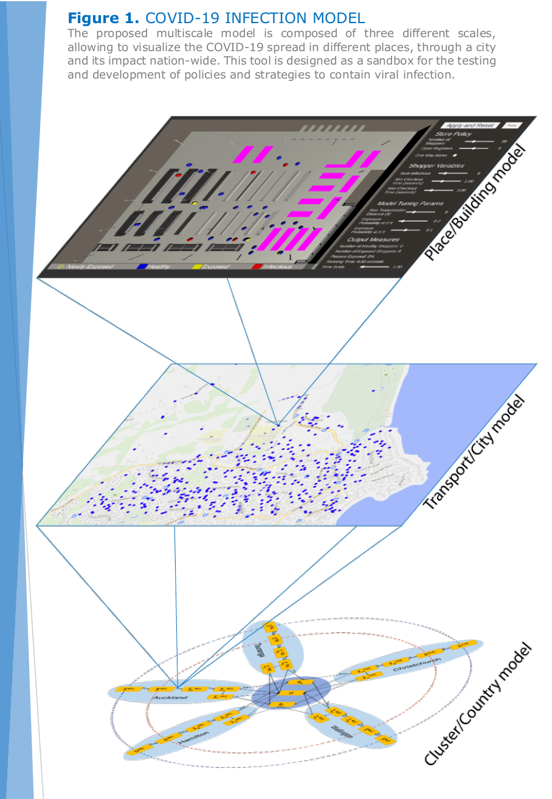
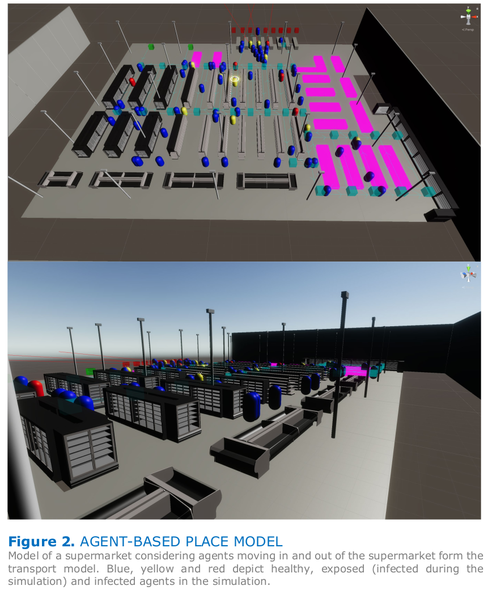
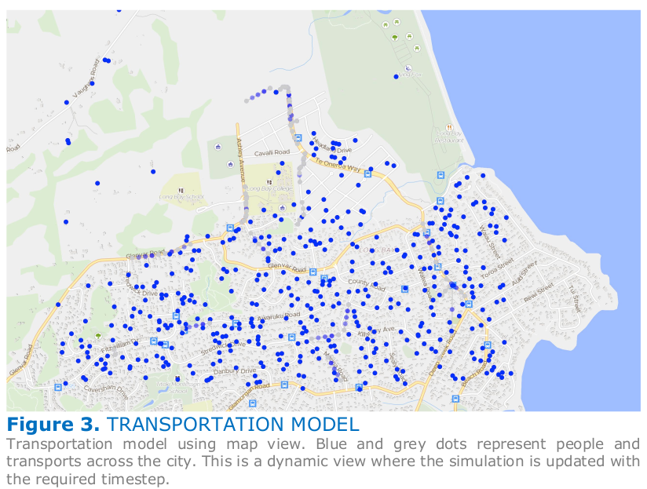
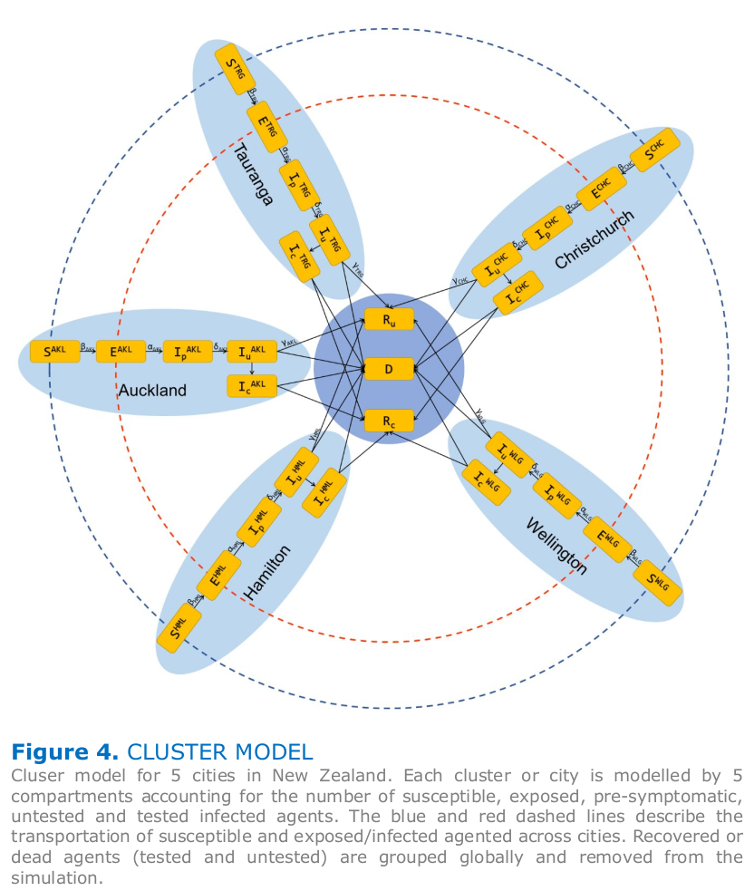

**Authors**: Mahyar Osanlouy, Gonzalo D. Maso Talou, David Brooks, Soroush Safaei, Alan Garny, and Peter J. Hunter  

---

## Introduction
Amid COVID-19 pandemic, a group of computational scientists and engineers in the ABI decide to set up models of COVID- 19 transmission and infection in New Zealand.
The taskforce developed technologies to model/analyze epidemic outbreaks, and a pipeline from data to model to visualization that offers a sandbox environment to test policies and track the infection process with an unprecedented level of details.

## Modelling infection in buildings, cities and countries: A multiscale integrative model

Modelling the spread of COVID-19 is of paramount importance to strategize
effective policies to reduce the impact of the disease in our health and economic
system. By means of this model, we can identify social interactions, places and
activities that favour the spread of the virus in order to propose appropriate
countermeasures. The model is also a sandbox environment where we can test
policies and observe the consequences in the complex environment of a city, to
understand the pros and cons of each action.

The model is composed of three scales: i) place/building scale; ii) transport/city
scale; iii) cluster/country scale. Each scale is implemented with a different type of
model (see Figure 1), and data between these models is communicated by a
homogenization process. In this process, data of the smaller scale computes the
parameters of the larger scale such that it represents the same phenomenology,
e.g., if the number of infections grew by 10 times during 10 hours in a transport
scale, then rate of infection for the country scale can be computed as one infection
per hour assuming a base 10 exponential growth model.

Finally, the model evolution and statistical analysis of the simulation is visualized
on top of a dynamic web interface that allows the users to easily navigate through
the results in time and space using cartographic and 3D views powered by Unity.
In the current development, simulations can be executed real-time, online
(visualizing results as the simulation is taking place) or offline. The offline modality
allows the user to navigate forward and backwards on time, turning the model
into an ideal tool for contact tracing and understanding the causality of a particular
scenario.

## Person-to-person transmission: Place model
The place model is implemented by means of agent-based models (ABMs) where
the actions and status of each person can be modelled, predicted and, if needed,
controlled. These models offer high-resolution inferences of infection
transmissions at the level of individuals giving us a clear understanding of the
impact of different infection mechanisms (sneeze, direct or via surface
transmission, social distancing efficiency, among others).

ABMs capture the interactions of individuals in time and space using real data and
detailed transmission pathways, providing insight into settings where transmission
is occurring and how clusters emerge. Various hypotheses can be tested by
modelling and evaluating social behaviour within different scenarios giving insights
about which elements are key to draw effective policies. In modelling disease
transmission, these scenarios may include different pandemic intervention
strategies deployed by government and/or policymakers such as containment,
mitigation, and suppression. Every individual (agent) also has specific attributes
which may contribute to the behaviour of the model and, as a result, to the result
of the disease transmission. Therefore, ABMs simulate the dynamics of a system
where individual-level characteristics, environmental factors, and the interaction
of the two are of importance.

As an example, we have developed an ABM to simulate the transmission of COVID-
19 across shoppers in a supermarket (see Figure 2). Here, shoppers are the agents
of the model which have particular attributes including basic demographics (as
accurate as possible), health states and characteristics (e.g. susceptible, immunity
to the disease, etc.), probability of practising social distancing and basic hygiene,
etc. These are what we call the specifics of the local transmission dynamics.
Additionally, a natural disease history model for COVID-19, i.e., the infectivity
profile from the onset of infection, over an incubation period, to the peak of
infectivity, to recovery, for a single symptomatic or asymptomatic individual
becomes extremely important in longitudinal simulations. The supermarket is the
spatial environment where the simulation is confined. It is precisely this
environment where the rules and policies are defined and the mutual interaction
with the shoppers occurs. The environment and its rules have direct and indirect
implications on the shoppers and, ultimately, on the probability of the disease
transmission. The same is also true for the effects of the shoppers and their
behaviour on the environment.

## Circulation and infection through the city arteries: Transport model

Cities are a complex aggregate of place models, where people navigate between
them at specific times of day using specific means of transportation, among which
infection is also occurring. The proposed transportation model communicates
numerous place models and computes infections while agents commute between
places.

This model deals with three complexities: (i) How to transport an agent from place
A to B for a given type of transportation; (ii) Which models of infection are
appropriate for each type of transportation mechanism (bus, private service,personal transport, walking, cycling, running, aeroplane and ferry); (iii) How an
agent decides the next action to perform after visiting a place.

To properly address (i), we need to consider the available path when the agent is
using a specific transport type. The route for commuting to work will be quite
different for bus, cycling and walking, as some spaces can be traversed for one
mode but not for the remaining ones. Then, specific transportation graphs are
derived for each type of transportation. Once the route is known, the agent will
have to compute a trip plan, which involves a set of intermediate action to reach
the final destination. For example, if the agent decides to take the bus to go to
the supermarket, he will perform the following actions: 1) walk to the bus stop, 2) wait until the bus arrives,3) commute 
from the bus stop of departure to the
bus stop of arrival, 4) walk from the arrival bus stop to the supermarket. To ensure
that the transport model delivers precise estimates of commuting time, it
considers the time of day, day of the week with the timetables when an agent is
using public transport. Also, the agents can define certain constraints as the
maximum walking distance, waiting time and number of bus connexions.

Regarding (ii), commuting by bus or walking through the street may clearly
present two different scenarios of exposure where a given set of policies will have
a different impact. Models for each transportation type can be modelled by specific
place models (as seen in the previous section), or by partial differential equations
(PDEs) considering the number of susceptible, exposed and infected subjects and
the total area of circulation. Each approach presents its advantages depending on
the policies to be tested, tracing detail required and available resources for the
simulation.

Lastly, (iii) is addressed by modelling the agent’s behaviour with a stochastic
planner. Each time an agent is idle the planner is executed, evaluating theprobability for this agent to take different actions (such as go to work, go to sleep,
return home, visit a friend, go shopping) based on his personal attributes (age,
occupation, family), history of previous actions and time and day of the week.
After all the probabilities have been computed, the agent performs the most
probable action. Once the action is finished the agent is idle and the planning
starts again.

Note that all the probabilities distributions needed to characterize the agent’s
behaviour and the number of agents across the country can be extracted from
national census data.

## Modelling nation-wide infection: Cluster models
The cluster model is based on the standard SEIR (susceptible-exposed-infected-removed) approach, gathering all transport model data for each city or region and
reducing it to a set of ordinary differential equations. The rates and coefficients of
this model can be computed by fitting each cluster model with the observations of
the corresponding transport model and, at the same time, the cluster model
informs the transport among cities serving as a boundary condition of the
transport model.

This macro-scale serves as a dashboard of the infection process in large
communities. Its simplicity renders tractable and easy to analyze variables, and
their variation over time - e.g. infection, mortality and recovery rates - which is
extremely useful for specialists and policymakers.
