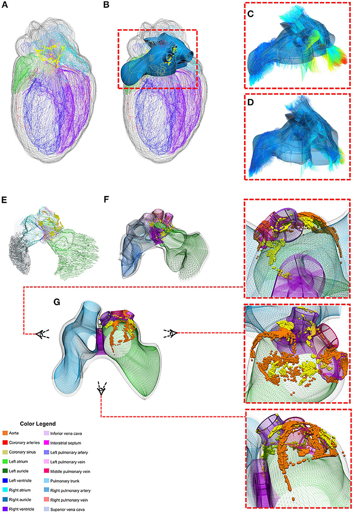

**Authors**: Mahyar Osanlouy, Anita Bandrowski, Bernard de Bono, David Brooks, Antonino M. Cassarà, Richard Christie, Nazanin Ebrahimi, Tom Gillespie, Jeffrey S. Grethe, Leonardo A. Guercio, Maci Heal, Mabelle Lin, Niels Kuster, Maryann E. Martone, Esra Neufeld, David P. Nickerson, Elias G. Soltani, Susan Tappan, Joost B. Wagenaar, Katie Zhuang, Peter J. Hunter  
**Publication**: *Front. Physiol.* (June 2021)   
**Website**: [SPARC Science](https://sparc.science/)   
**Interactive 3D Models & Data**: [MAP Web App](https://sparc.science/apps/maps?type=ac)

---

## Overview
The NIH Common Fund's Stimulating Peripheral Activity to Relieve Conditions (SPARC) program is an ambitious initiative 
aimed at revolutionizing our understanding of the autonomic nervous system (ANS) and its role in organ function.
As the lead developer for the Mapping Core (MAP-Core) of the SPARC Data and Resource Center (DRC), I collaborated 
with an interdisciplinary team to create a comprehensive framework for curating, visualizing, and analyzing ANS data
across different species.

The SPARC DRC serves as the technological foundation for the SPARC program, providing researchers worldwide with access
to standardized experimental data, computational models, and visualization tools through a unified web portal 
(https://sparc.science). Our work addresses a critical gap in biomedical research: the need for standardized,
reproducible, and interoperable data and computational resources to advance our understanding of neural control of 
organ function and develop effective neuromodulation therapies.

---

## Key Contributions
Our team developed several groundbreaking innovations that form the technological foundation of the SPARC program:

### 1. FAIR-Compliant Data Management Platform
We implemented comprehensive data standards and workflows to ensure all SPARC data adheres to FAIR principles 
(Findable, Accessible, Interoperable, and Reusable). This includes standardized metadata schemas, dataset organization
structures, and persistent identifiers for long-term data discoverability.

### 2. Knowledge Management System
We created a sophisticated knowledge graph integrating anatomical relationships, neural connectivity, and semantic 
annotations from multiple species. This system enables powerful cross-species comparisons and semantic searches that 
were previously impossible with traditional database approaches.

### 3. Multi-Scale Anatomical Mapping Framework
One of our most significant innovations is the development of 3D material coordinate systems ("scaffolds") for organs 
and bodies. These scaffolds provide a revolutionary solution to a complex problem: how to map and compare data from
organs that undergo substantial deformation (e.g., beating hearts, inflating lungs) across different experimental
conditions and species.

### 4. Computational Modeling Platform
We developed o²S²PARC ("open, online simulations for SPARC"), an online computational environment that enables 
researchers to analyze data, develop models, and simulate neuromodulation scenarios using cloud computing resources.

---

## Methodology
### Developing Standardized Data Workflows
We established comprehensive curation and data standards to ensure consistency across all SPARC datasets.
Key aspects include:

- Implementation of the SPARC Dataset Structure (SDS) for consistent file organization 
- Development of the Minimal Information Standard (MIS) for semantic metadata 
- Integration with community ontologies and specialized annotation tools 
- Creation of SODA (Software for Organizing Data Automatically) to assist researchers in preparing data submissions

### Creating Neural Connectivity Maps
To represent the complex connectivity of the ANS across different species, we:

- Utilized the ApiNATOMY toolkit to create topological and semantic models of neural pathways 
- Generated interactive flatmap diagrams that visualize neural connectivity in 2D for multiple species 
- Linked these maps to the SPARC Knowledge Graph for data integration

### 3D Scaffold Framework for Anatomical Mapping
A cornerstone of our innovation is the development of the 3D scaffold system. This methodology addresses the
fundamental challenge of mapping data from organs that undergo significant deformation. Our approach includes:

#### 1. Material Coordinate System Development
We developed Scaffold-Maker, specialized CAD software that creates 3D material coordinate systems for body organs.
These scaffolds use finite element meshes with smooth interpolation to represent complex anatomical geometries.

#### 2. Cross-Species Anatomical Representation
We designed the scaffolds to accommodate topological differences between species, allowing for meaningful cross-species 
comparisons despite anatomical variations. For example, we created heart scaffolds that accommodate different numbers 
of pulmonary veins in humans (4), pigs (2), and rats (3).

#### 3. Deformation-Invariant Mapping
Our material coordinate system maintains consistent references to tissue locations regardless of organ deformation.
This allows data to be mapped and compared across different physiological states (e.g., cardiac contraction phases).

#### 4. Integration with Whole-Body Models
We developed methods to embed organ scaffolds within whole-body coordinate systems, facilitating multi-scale data
integration from cellular to organism levels.

---

## Results
Our work has produced several tangible outcomes that demonstrate the power of the SPARC DRC infrastructure:

### Comprehensive ANS Data Resource
The SPARC Portal now serves as the world's most comprehensive resource for standardized ANS data, with:

- Curated datasets from multiple species and organ systems 
- Rich semantic annotations linking experimental data to anatomical locations 
- Standardized protocols and metadata ensuring reproducibility

### Species-Specific Anatomical Scaffolds
We have successfully created detailed 3D scaffolds for key organs across multiple species:

- Heart scaffolds for human, pig, and rat with species-specific topologies
- Colon scaffolds capturing species variations in haustra and taeniae coli structures 
- Whole-body scaffolds with embedded organ systems 
- Bladder, stomach, and lung scaffolds for integrating diverse experimental data

### Neural Mapping Demonstrations
We have demonstrated successful registration of neural data to our scaffold systems:

- Mapping of intrinsic cardiac neurons (ICNs) from rat hearts to a standardized cardiac scaffold 
- Integration of data from multiple specimens into "integrative" scaffolds 
- Preservation of spatial relationships across deformed organ states

### Computational Modeling Environment
The o²S²PARC platform now provides:

- Online access to sophisticated computational models 
- Tools for simulating neuromodulation effects 
- Reproducible workflows for data analysis 
- Collaborative environments for model development

---

## Implications
The SPARC DRC infrastructure we've developed has significant implications for both basic science and clinical
applications:

### Advancing Basic Science
Our work enables new approaches to understanding the ANS by:

- Facilitating cross-species comparisons of neural circuitry 
- Providing standardized reference systems for integrating multi-scale data 
- Creating a foundation for quantitative, data-driven neural mapping 
- Enabling reproducible computational analyses

### Clinical Applications
The infrastructure directly supports the development of bioelectronic medicine by:

- Providing detailed anatomical maps for targeting neuromodulation 
- Enabling simulation of device effects on neural activity 
- Supporting the optimization of stimulation parameters 
- Facilitating translation between animal models and human applications

### Beyond SPARC
The methodologies and tools we've developed have applications beyond the ANS:

- The scaffold concept can be applied to any deformable biological system 
- Our FAIR data management approaches set standards for other large-scale initiatives 
- The o²S²PARC computational platform can support diverse modeling applications

---

## Conclusion
The SPARC DRC represents a paradigm shift in how we approach the study of the autonomic nervous system. By creating 
standardized frameworks for data organization, anatomical mapping, and computational modeling, we've laid the groundwork
for a new era of quantitative, integrative neuroscience research that can directly inform the development of 
bioelectronic therapies. Our 3D scaffold methodology, in particular, solves the fundamental challenge of mapping
biological data in deformable systems, enabling unprecedented integration of experimental data across scales, species,
and physiological states.
