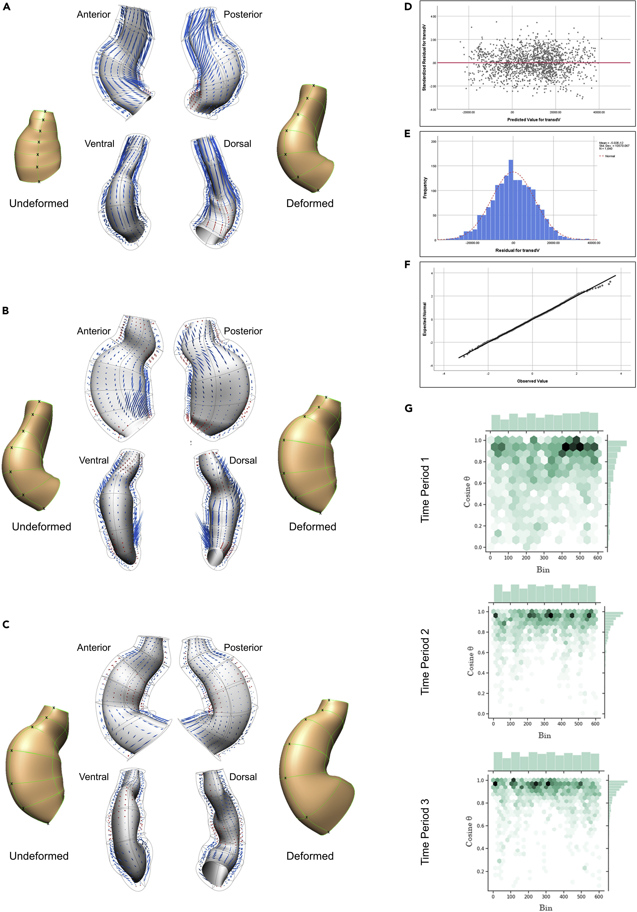

**Authors**: Nazanin Ebrahimi, Mahyar Osanlouy, Chris Bradley, Fabiana Kubke, Dane Gerneke, Peter Hunter     
**Publication**: *iScience.* (July 2022)   
**Dataset**: [Mendeley Data](https://doi.org/10.17632/jwj6m5yxct.1)

## Overview  
This study presents an innovative hybrid experimental-computational pipeline to investigate the **spatiotemporal growth patterns** underlying cardiac C-looping in embryonic chick hearts. C-looping is a critical phase in heart development where the straight heart tube transforms into a C-shaped structure, setting the stage for proper chamber formation. Abnormalities during this process are linked to congenital heart defects. The work combines **multi-scale imaging**, **deep learning-based cell segmentation**, and **biomechanical modeling** to bridge cellular dynamics with tissue-level deformations, offering new insights into the mechanisms driving heart morphogenesis.

---

## Key Contributions  
1. **First 3D multi-scale dataset** of C-looping hearts, integrating cell-to-organism level data from confocal microscopy and micro-CT.  
2. **Fully automated 3D myocardial cell segmentation** using a custom convolutional neural network (CNN), achieving a Dice coefficient of 0.91 ± 0.1.  
3. **Finite Element (FE) biomechanical models** capturing spatiotemporal heart geometry changes across four developmental timepoints.  
4. **Variance-driven analysis** revealing how inter-cellular space (ICS) and cellular heterogeneity contribute to tissue growth.  
5. **Open-source pipeline** for integrating cellular features with tissue-level kinematics, enabling future studies on cardiac morphogenesis.

---

## Methodology  

### Experimental Workflow  
1. **Multi-modal imaging**:  
   - **Confocal microscopy**: Whole-mount staining (WGA, NCAM-1, DAPI) provided 3D cell-resolution images of myocardial cells.  
   - **Micro-CT scanning**: Sub-micron resolution imaging contextualized heart geometry within the entire embryo.  
   - **Optical clearing**: Enabled high-resolution imaging while preserving 3D architecture.  

2. **Temporal staging**: Embryos were ordered developmentally using anatomical landmarks and dorsal detachment metrics.  

### Computational Workflow  
1. **3D Deep Learning for Cell Segmentation**:  
   - A **3D U-Net architecture** was trained to segment individual myocardial cells from confocal stacks.  
   - Achieved 91% Dice similarity compared to manual segmentation, reducing processing time from **8 hours to seconds** per 100 cells.  
   - Addressed memory constraints via a traceable slicing-merging algorithm for large-scale image processing.  

2. **Finite Element Modeling**:  
   - Anatomically accurate FE meshes were fitted to heart geometries using OpenCMISS.  
   - RMS fitting error < 3 μm enabled precise representation of tissue deformation.  

3. **Spatiotemporal Analysis**:  
   - Cellular features (volume, anisotropy, orientation) were mapped onto FE meshes.  
   - **General Linear Model (GLM)** linked tissue growth to cellular dynamics (cell number, ICS volume, anisotropy).  

---

## Results  
1. **Differential Growth Patterns**:  
   - Ventral regions showed ~2x higher tissue growth than dorsal regions, driven by increased cell proliferation and ICS expansion.  
   - Outer curvature cells exhibited circumferential alignment, while inner curvature cells remained isotropic.  

2. **Role of Inter-Cellular Space (ICS)**:  
   - ICS accounted for 30–45% of tissue volume changes, highlighting its role in accommodating growth.  
   - Ventral ICS volume increased by 62% during bending phases.  

3. **Variance as a Developmental Signal**:  
   - **Ring-shaped variance patterns** in cell volume/anisotropy emerged around the outer curvature, suggesting mechanical feedback loops.  
   - High-variance regions correlated with zones of rapid tissue remodeling.  

4. **Tissue-Cell Dynamics**:  
   - GLM analysis explained 70% of tissue growth variance, with cell number (β = 0.48, p < 0.001) and ICS (β = 0.32, p < 0.01) as key predictors.  
   - Cell orientation aligned with tissue deformation vectors during rotation (r > 0.8) but not bending phases.  

---

## Implications  
- **Mechanistic Insights**: Challenges the "differential growth hypothesis" by showing ICS and cellular heterogeneity are equally critical to looping.  
- **Toolkit for Developmental Biology**: The pipeline is extensible to other organs/species, enabling studies on how cellular noise shapes tissue patterning.  
- **Clinical Relevance**: Provides a framework to explore how genetic mutations disrupt growth coordination, informing congenital heart defect research.  
- **AI/ML Impact**: Demonstrates the power of deep learning in automating large-scale 3D biological image analysis.  

