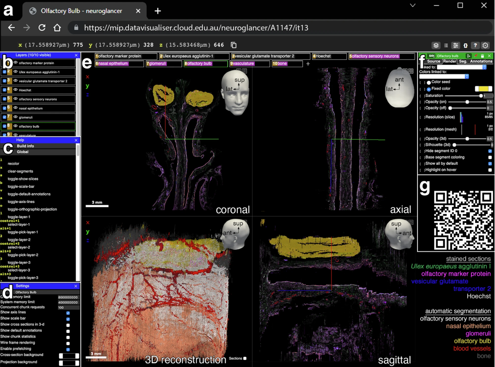

**Authors**: Victoria F Low, Chinchien Lin, Shan Su, Mahyar Osanlouy, Mona Khan, Soroush Safaei, Gonzalo Maso Talou, Maurice A Curtis, Peter Mombaerts    
**Publication**: *Communications Biology* (November 2024)  
**Code**: [Zenodo Repository](https://zenodo.org/records/7865523)  
**Interactive 3D Model**: [Neuroglancer Platform](https://www.nature.com/articles/s42003-024-07017-4)  

---

## Overview  
This study presents a computational pipeline to reconstruct the 3D microanatomy of the human olfactory system, from the
nasal cavity to the olfactory bulb—using fluorescence histology, deep learning, and high-performance computing (HPC).
The workflow addresses challenges in processing terabyte-scale datasets and provides new insights into olfactory sensory 
neuron (OSN) distribution and axon trajectories.

---

## Key Computational Contributions  
1. **First end-to-end pipeline** for large-scale 3D reconstruction of human olfactory tissues (~7.45 cm³ specimen, 1234 
sections).  
2. **CNN-based segmentation** achieving Dice scores >0.85 for critical structures (OSNs, glomeruli, vasculature).  
3. **HPC-optimized registration** reducing banana-effect artifacts via multi-resolution deformable alignment.  
4. **Public 3D dataset** enabling interactive exploration of olfactory projection via Neuroglancer.

---

## Methodology  

### Computational Pipeline  


*From fluorescence histology to 3D visualization – click to expand*

1. **Fluorescence Histology**  
   - Quadruple staining: Hoechst (nuclei), UEA1 (OSNs), OMP (mature OSNs), VGLUT2 (axon terminals).  
   - Whole-slide scanning: 1.097 µm/pixel resolution, ~2.9 TB raw data.

2. **CNN Segmentation**  
   - Architecture: Modified 2D U-Net with 4 input channels (Hoechst + 3 markers).  
   - Training: Bootstrap approach with iterative ground truth expansion (20-45 sections/structure).  
   - Key layers:  
     ```
     # Simplified U-Net structure
     encoder = [Conv2D(8→16→32), MaxPooling2D]
     bottleneck = Conv2D(64) + Upsampling2D
     decoder = [Conv2D(32→16→8), Concatenate(skip connections)]
     ```

3. **HPC Registration**  
   - **Intra-block**: Parallel registration of 247 blocks (5 sections each) using SimpleElastix.  
   - **Inter-block**: Banana-effect correction via affine + B-spline transformations between blocks.  
   - Metrics: Mutual information for intensity alignment, DSC for structural consistency.

---

## Results  

### Segmentation Performance  
| Structure      | Dice Score | Binary Cross-Entropy |  
|----------------|------------|----------------------|  
| Vasculature    | 0.808      | 0.0148               |  
| OSNs           | 0.760      | 0.0173               |  
| Glomeruli      | 0.779      | 0.0017               |  

*OSN segmentation achieved single-cell resolution in sparse regions but grouped cells in dense zones.*

### Registration Efficiency  
- 1082 CPU hours on 96 Intel Xeon Gold 6136 cores  
- 16% error reduction vs. sequential registration  
- Tolerance: ±80 µm axial drift corrected

### Key Findings  
1. **OSN Count**: ~2.7 million OSNs calculated via morphometric extrapolation (90% CI: 2.4–2.9M).  
2. **Fila Olfactoria**: 34 foramina identified in cribriform plate (17/side).  
3. **Non-uniform Distribution**: Olfactory epithelium showed serrated borders and posterior-anterior density gradient.

---

## Implications  

### Technical Advancements  
- **Scalable ML**: Method enables processing of whole-brain datasets (~100x mouse brain volume).  
- **Clinical Potential**: Pipeline adaptable for Parkinson’s/Alzheimer’s studies via α-synuclein/tau staining.  
- **Open Science**: First public 3D olfactory dataset with ~5.8 GB/channel resolution.

### Biological Insights  
- Challenges mouse-to-human extrapolation: ~10x fewer OSNs/glomerulus vs. mice.  
- Provides baseline for studying SARS-CoV-2 olfactory dysfunction.

---

## Computational Tools Used  
- **Segmentation**: TensorFlow U-Net, Fiji for ground truth  
- **Registration**: SimpleElastix, ITK  
- **Visualization**: ParaView, Neuroglancer  
- **HPC**: New Zealand eScience Infrastructure (NeSI)  

  
*Interactive 3D exploration*

---
