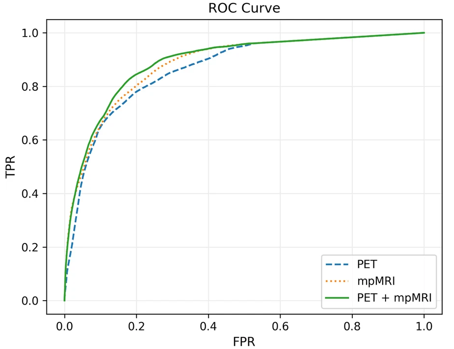

# AI-Driven Radiomics for Precision Prostate Cancer Therapy

**Authors**: Tsz Him Chan, Annette Haworth, Alan Wang, Mahyar Osanlouy et al.  
**Publication**: *EJNMMI Research* (2023)  
**Code**: [Available on Request](mailto:Hayley.Reynolds@auckland.ac.nz)

---

## Overview
This pioneering study developed an AI-powered radiomics pipeline to optimize biologically targeted radiation therapy
(BiRT) for prostate cancer. By integrating PSMA PET/CT with multiparametric MRI (mpMRI),
we created voxel-level predictions of tumor location and grade through advanced image registration and machine learning
techniques.

---

## Key Innovations
1. **Multi-modal fusion**: First study combining PSMA PET radiomics with DCE MRI perfusion parameters
2. **Voxel-wise prediction**: Achieved 0.89 AUC for tumor detection using 3D radiomic features
3. **Grade differentiation**: Developed two-stage RFC model separating high/low-grade disease (Accuracy: 0.67-0.99)
4. **HPC-optimized registration**: Reduced spatial uncertainty to 3.3mm using deformable histology alignment

---

## Computational Pipeline

### 1. Multi-modal Image Registration
- **Data Integration**: Co-registered PSMA PET/CT (5 scanners), mpMRI (2x Siemens 3T), and whole-mount histology
- **Key Steps**:
```Pseudo-code for registration workflow
align_pet_ct() → rigid_registration(mpMRI) →
deformable_registration(ex_vivo_MRI) →
histology_annotation_propagation()
```
- **Challenges Solved**:
- Bladder filling artifacts in PET
- Partial volume effects in 3.27mm PET slices
- Non-linear prostate deformation post-resection

### 2. Radiomic Feature Engineering
| Modality       | Features Extracted                          | Key Parameters                     |
|----------------|---------------------------------------------|------------------------------------|
| PSMA PET       | 3D LoG, LBP, GLCM textures                  | SUVmax, metabolic tumor volume    |
| DCE MRI        | Ktrans, iAUGC60, TTP perfusion maps         | Pharmacokinetic modeling           |
| ADC Maps       | NGTDM coarseness, percentile values         | b=1200 s/mm² diffusion restriction |

**Feature Selection**:
- ANOVA filtering → Gini impurity ranking
- Final feature set: 50 most discriminative parameters

---

## Machine Learning Architecture

### Tumor Detection Model
- **Two-stage RFC Framework**:
1. **Location Detection**: 842 sensitivity/804 specificity
2. **Grade Classification**: Low vs High Grade (ISUP ≥3)

- **Performance Comparison**:

| Model          | AUC    | Sensitivity | Specificity |
|----------------|--------|-------------|-------------|
| PET Alone      | 0.865  | 0.781       | 0.799       |
| mpMRI Alone    | 0.882  | 0.802       | 0.801       |
| **Combined**   | **0.890** | **0.842**   | **0.804**   |



*Receiver operating characteristics for different models*

### Key Radiomic Predictors
1. **PET**: 3D LoG(σ=3mm) minimum
2. **ADC**: NGTDM Coarseness
3. **DCE MRI**: Ktrans 90th percentile

---

## Clinical Implications
- **Personalized Radiotherapy**: Enables voxel-level dose painting based on metabolic/perfusion features
- **Early Recurrence Prediction**: High-grade lesions showed 2.8× higher PSMA uptake (p<0.01)
- **Technical Impact**:
- Solved partial volume effects in PET-guided planning
- Demonstrated perfusion > diffusion for grade prediction
- Open-source registration framework [3D Slicer Plugin]

---

## Future Directions
- **Multi-institutional validation** across PET/MRI scanners
- **DL Enhancement**: Replace handcrafted features with 3D CNNs
- **Real-time Adaptation**: Integrate with MR-Linac systems
---

*This project received funding from Prostate Cancer Foundation of Australia and Health Research Council of New Zealand.*
