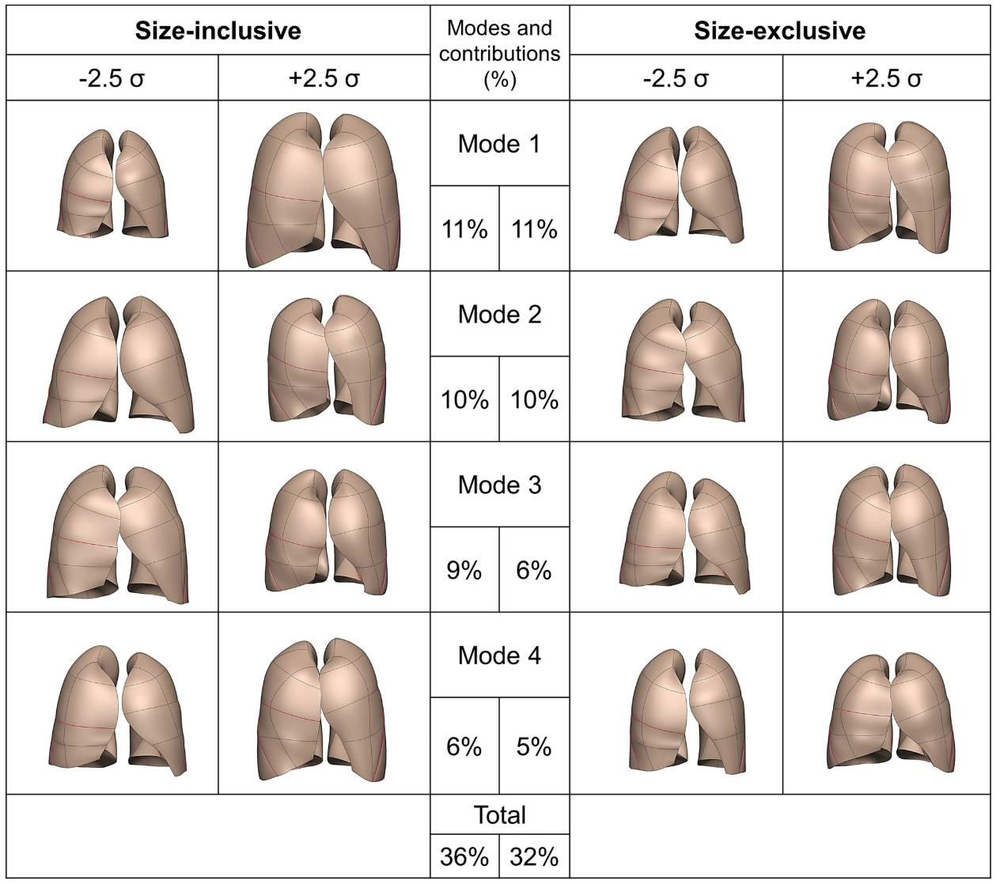

**Authors**: Mahyar Osanlouy, Alys R. Clark, Haribalan Kumar, Clair King, Margaret L. Wilsher, David G. Milne, Ken Whyte, Eric A. Hoffman & Merryn H. Tawhai
**Publication**: *Nature Scientific Reports.* (September 2020)   
**Code**: [Mendeley Data](https://github.com/mahyar-osn/SFEAL)

## Overview
This project presents a quantitative investigation into age‐related variations in lung and fissure shape among healthy adults (aged 20–90 years). By integrating advanced finite element mesh fitting techniques with statistical shape modeling and principal component analysis (PCA), the study establishes a robust framework for capturing and quantifying subtle geometric changes in lung morphology. Such a mathematical framework provides a normative baseline against which pathological alterations may be compared.

## Key Contributions
- **Integration of Finite Element Modeling and PCA:**  
  • Developed a high-order finite element (FE) mesh fitted to segmented lung surfaces, incorporating curvature and smoothness constraints.  
  • Applied PCA to reduce dimensionality, isolating principal modes of shape variation.  

- **Mathematical Modeling of Shape Deformations:**  
  • Formulated an energy minimization problem that couples data fidelity with smoothness constraints.  
  • Expressed lung shape variations as weighted perturbations from a mean model in a high-dimensional space.

- **Clinical Insights:**  
  • Revealed strong associations between lung geometry, age, and BMI.  
  • Enabled detection of subtle fissure shifts and volumetric changes, likely reflecting underlying tissue elasticity.

## Methodology

### Finite Element Mesh Construction
Each lung is represented by a finite element mesh with a fixed topology (225 nodes in this study). To ensure an accurate and smooth representation, the mesh is fitted to imaging data by minimizing an energy functional that balances data fidelity against surface smoothness.

#### Energy Model Formulation
The energy function is defined as:

$$
T(u) = \sum_{i=1}^{N} \gamma_i \left\| z(\xi_i) - z_d \right\|^2 + \int_{\Omega} g(u(\xi))\, d\xi,
$$

where:
- $( u )$ is the vector of shape (or nodal displacement) parameters.
- $( z(\xi_i) $) represents the geometric position of a node in local parametric coordinates \( \xi_i \).
- $( z_d $) is the target data point from the segmented lung surface.
- $( \gamma_i $) is a weight factor controlling data matching for each node.
- $( g(u(\xi)) $) is the smoothness (regularization) term that penalizes rapid or non-physical deformations.
- $( \Omega $) denotes the domain over which the mesh is defined.

This formulation ensures that the FE mesh adapts to the lung's surface while preserving a biologically plausible smooth geometry.

#### Pseudo-code for Mesh Fitting

    for each subject: 
        // Step 1: Initialize template mesh 
        Initialize template_mesh with 225 nodes
    
        // Step 2: Define anatomical landmarks
        Define landmarks:
            - Apices
            - Diaphragm
            - Lung base edges
            - Anterior segments
    
        // Step 3: Optimize node positions using energy minimization
        Optimize node positions by minimizing the energy function T(u):
    
            T(u) = Σγ ||z(ξ₁, ξ₂) - z_d||² + ∫ g(u(ξ)) dξ
    
            // where:
            // z    = nodal coordinates (x, y, z)
            // g    = smoothness constraint (curvature regularization)
            // γ    = data matching weight factor

*Mean fitting error: 5.2 ± 2.3 mm*

### Data Alignment and Statistical Shape Modeling
Prior to PCA, lung shapes are aligned using General Procrustes Analysis (GPA) to eradicate variations due to 
translation, rotation, and, in the case of the size-exclusive model, scaling.

#### Alignment Equation
The alignment is expressed as:

$$
\bar{S} = \alpha R S + T,
$$

where:
- $( S $) is the original shape vector,
- $( R $) is the rotation matrix,
- $( T $) is the translation vector,
- $( \alpha $) is the scaling factor (applied only in size-inclusive models).

### Principal Component Analysis (PCA)
PCA is employed to reduce the high-dimensional shape vector into principal modes that capture the primary sources of variance.

#### PCA Decomposition via SVD
The shape matrix $( \mathbf{S} $) is decomposed using singular value decomposition (SVD):

$$
\mathbf{S} = \mathbf{U} {\Sigma} \mathbf{V}^{T},
$$

where:
- $( \mathbf{U} $) contains the eigenvectors of $( \mathbf{S} \mathbf{S}^{T} $),
- $( {\Sigma} $) is the diagonal matrix of singular values $( \sigma_i $) (with $( \lambda_i = \sigma_i^2 $) being 
the eigenvalues),
- $( \mathbf{V}^{T} $) holds the principal directions in the data space.

Each lung shape is reconstructed as:

$$
M_{l}(w) = \bar{S}_0 + w\, u_{l},
$$

with:
- $( \bar{S}_0 $) being the mean shape,
- $( u_l $) the $( l $)th principal component,
- $( w \) the corresponding weight factor.

The variance explained by each mode is:

$$
\text{Variance Explained} = \frac{\sigma_l^2}{\sum_{i} \sigma_i^2} \times 100\%.
$$

## Results
- **Correlation with Age:**  
  Specific principal shape modes display strong correlations with age (e.g., $( R = -0.75, \; p < 0.001 $)), 
- indicating that lung geometries become more “pyramidal” as age increases.

- **Sex and BMI Associations:**  
  Differences in shape related to lung size manifest in the size-inclusive model, highlighting sex-related volumetric differences. In contrast, the size-exclusive model emphasizes purely geometric deformations, with moderate correlations observed for BMI.

## Implications
- **Clinical Applications:**  
  The detailed mathematical framework enables lung shape to be employed as a biomarker for aging and disease. Deviations from the normative PCA model may assist in early detection or staging of conditions like COPD and IPF.

- **Technical Advancements:**  
  The fusion of finite element modeling with PCA offers a versatile and robust method for analyzing complex organ shapes. This approach can be adapted to other anatomical structures requiring similar quantitative assessments.

- **Future Directions:**  
  Enhancing the energy model and incorporating dynamic imaging (e.g., covering breathing cycles) could further refine shape analysis. Additionally, exploring non-linear dimensionality reduction techniques may uncover further subtleties in lung morphology.
