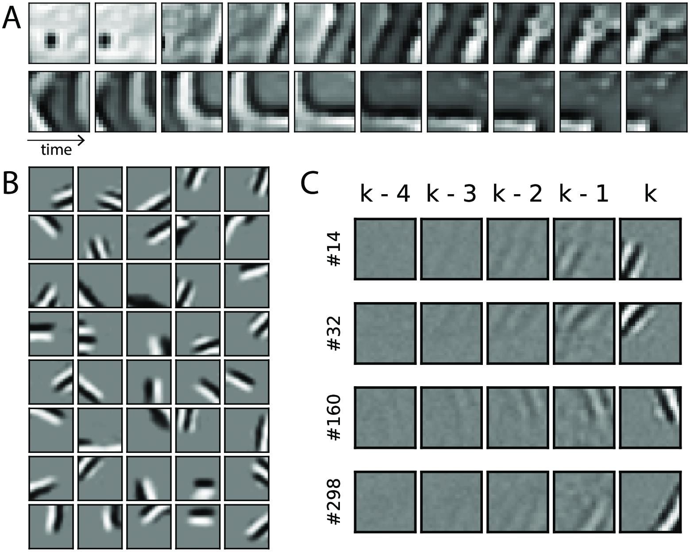
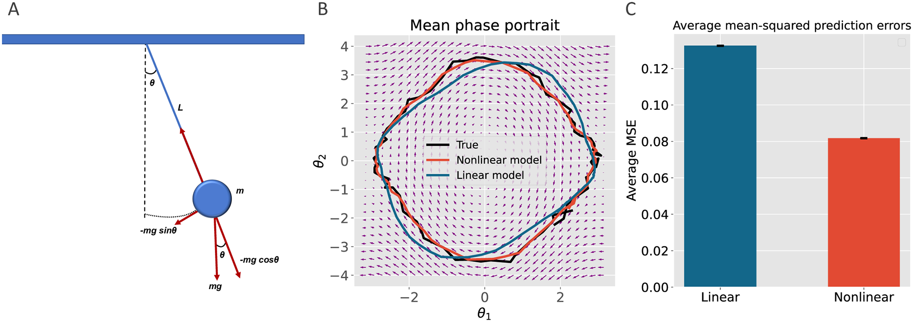

**Authors**: Beren Millidge, Mufeng Tang, Mahyar Osanlouy, Nicol S. Harper, Rafal Bogacz
**Publication**: PLOS Computational Biology (April 2024)
**Code**: [GitHub Repository](https://github.com/C16MItang/temporal-predictive-coding)
**Read the paper**: [PLOS Computational Biology](https://doi.org/10.1371/journal.pcbi.1011183)

## Overview
How does the brain process dynamic sensory inputs; like tracking a moving object or predicting the next note in a melody?
In this work, we propose **temporal predictive coding (tPC)**, a biologically plausible neural framework that extends
classical predictive coding to handle time-varying stimuli. By unifying Bayesian inference, neural dynamics,
and synaptic plasticity, tPC explains how cortical circuits might learn to predict and adapt to continuously
changing environments.

---

## Key Contributions
1. **A unified model for temporal prediction**:
   tPC bridges predictive coding (for static inputs) and Kalman filtering (for dynamic systems), enabling online inference and learning without complex matrix operations.

2. **Biologically plausible implementation**:
   The model uses only **local computations** and **Hebbian plasticity**, aligning with known cortical microcircuit architecture.

3. **Motion-sensitive receptive fields**:
   When trained on natural movies, tPC neurons develop Gabor-like, direction-selective receptive fields—matching properties of early visual cortex neurons.

4. **Nonlinear generalization**:
   The framework extends to nonlinear systems (e.g., pendulum dynamics), outperforming linear models in complex tasks.

---

## Methodology

### Core Principles
- **Generative model**: Hidden states evolve via a Markov process, with observations generated from hidden states.
$$x_k = A f(x_{k-1}) + B u_k + \omega_x$$
$$y_k = C f(x_k) + \omega_y$$

- **Free energy minimization**:
  Neurons minimize prediction errors at two levels:
  1. **Sensory errors**: Mismatch between predicted and actual observations.
  2. **Temporal errors**: Mismatch between predicted and inferred hidden states.

- **Neural implementation**:
  - Explicit prediction error neurons or dendritic computations.
  - Synaptic updates follow local Hebbian rules (e.g., ΔA ∝ prediction error × presynaptic activity).

### Comparison to Kalman Filtering
- tPC approximates Kalman filtering but avoids tracking posterior uncertainty.
- Achieves similar accuracy in linear tracking tasks with simpler computations.
$$\hat{x}_k^- = A \hat{x}_{k-1} + B u_k$$
$$\hat{x}_k = \hat{x}_k^- + K(y_k - C\hat{x}_k^-)$$
$$K = \Sigma_x C^T \left[C \Sigma_x C^T + \Sigma_y \right]^{-1}$$
---

## Results

### 1. Robust Tracking of Dynamic States
- tPC accurately infers position, velocity, and acceleration from noisy observations, even with scrambled sensory inputs.
- Matches Kalman filter performance with 5 inference steps (MSE difference < 1%).

### 2. Learning Synaptic Weights
- Hebbian plasticity enables online learning of dynamics (**A**, **B**) and observation (**C**) matrices.
- Learns to predict observations even with random initial weights.

### 3. Biological Receptive Fields
- Trained on natural movies, tPC develops:
  - **Spatiotemporal receptive fields** with motion direction selectivity.
  - Gabor-like filters resembling V1 simple cells.
  
  *Representations developed by the model when trained with patches from movies of dynamic natural scenes.
  A: First 10 frames of 2 example training movies used in our experiments. Patches extracted from movies obtained
  at websites pexels.com, pixabay.com and commons.wikimedia.org (for wikimedia attributions
  see https://github.com/C16Mftang/temporal-predictive-coding). B: The projective fields C developed Gabor-like
  filters after training. C: Space-time receptive fields developed by hidden neurons of the tPC model.
  https://doi.org/10.1371/journal.pcbi.1011183.g006*

### 4. Nonlinear Dynamics
- Outperforms linear models in predicting pendulum motion (20% lower MSE).
- Captures nonlinearities where linear approximations fail (e.g., large-angle oscillations).
  
  ***Simulations of the pendulum**. **A:** A free-body diagram of a simple pendulum that has a mass m attached to a string
with length $L$. Also shown are the forces applied to the mass. The restoring force $-mg sin \theta$ is a net force toward
the equilibrium position. **B:** A phase portrait of the pendulum simulation showing the result of our linear versus
nonlinear models prediction for the ground-truth data. The vector field (i.e. set of small arrows) was
created by computing the derivatives of $\frac{d\theta_1}{dt}$ and $\frac{d\theta_2}{dt}$ at $t = 0$ a grid of 30
points over the range of $-\pi$ to $\pi$ and -4 to +4 for $\theta_1$ and $\theta_2$ respectively. **C:** The barplot
shows the difference between the mean prediction errors of the linear model versus the nonlinear model from 100
simulations with varying noise profiles. The mean errors are significantly different $(p \ll 0.001)$
https://doi.org/10.1371/journal.pcbi.1011183.g007*

---

## Implications
- **Theoretical**: Provides a unified account of static and dynamic sensory processing under predictive coding.
- **Experimental**: Predicts neural responses to time-varying stimuli and receptive field properties.
- **Translational**: Framework for neuromorphic hardware and efficient machine learning models.

---

